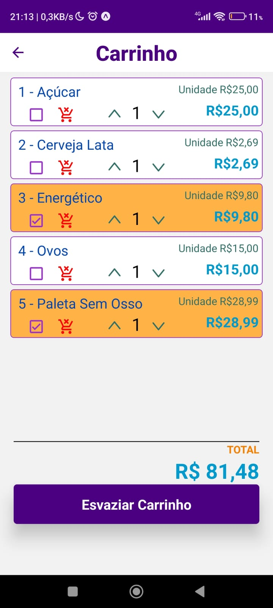

# 📱 Lista de Compras

## ✨ Introdução✨

Esta é minha **Lista de Compras**! Este projeto foi criado para conseguir auxiliar o usuário a organizar as suas compras. Principal função é adicionar os produtos no carrinho para não esquecer dos mesmos ao ir ao mercado.
A Aplicação é bem simples, foi uma das primeiras que fiz, porém estou refatorando e melhorando ela.

## 🚀 Funcionalidades

- Adicionar produtos;
- Remover Produtos;
- Selecionar os produtos dentro da lista do carrinho, uma opção para saber se já pegou o produto ou não;
- Ter prévia do valor das compras;

## ⚙️ Tecnologias Utilizadas:

    - ⚛️ React Native;
    - ⚛️ Expo;
    - 🚀 JavaScript;

|  |  |
| :-------------------------------------: | :-------------------------------------------: |

|  |  |
| :---------------------------------------: | :-----------------------------------------------------------: |

|  |  |
| :------------------------------------------------: | :--------------------------------------------------: |

## Licença

-**Suporte**
Para suporte ou feedback, entre em contato via WhatsApp: +55 (61) 99835-4398 (https://wa.me/5561998354398) ou pelo email: lyncoln_erc@hotmail.com

---

2024 | Desenvolvido por Emerson Ribeiro
